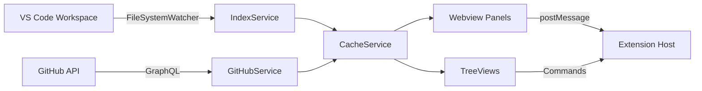

# VS Code Extension: Agent Org Platform

## TL;DR

> **Quick Summary**: Transform Agent Org Platform from web mockup to VS Code Extension with Knowledge Graph, Pipeline Kanban, Need Human Queue, and Document Viewer.
> 
> **Deliverables**:
> - Monorepo with 4 packages (extension, webview-ui, core, github)
> - WebviewPanels for Graph and Kanban views
> - TreeViews for Documents and Queue
> - GitHub authentication and Projects v2 integration
> - QuickPick-based global search
> 
> **Estimated Effort**: Large (3-5 days)
> **Parallel Execution**: YES - 3 waves
> **Critical Path**: Core types → Extension scaffolding → Webview UI

---

## Context

### Original Request
사용자가 Agent Org Platform을 VS Code Extension으로 개발하고 싶어함. 리서치, 기획, 설계 단계를 거쳐 프로젝트 구조를 구성하고 관련 문서 업데이트 후 작업 진행 요청.

### Research Summary

**VS Code Extension APIs**:
- `WebviewPanel`: Complex UIs (graphs, kanban) - React in iframe
- `TreeView`: Hierarchical data (file trees, lists)
- `CustomTextEditor`: Custom document viewers
- `QuickPick`: Command palette style search
- `vscode.authentication`: GitHub OAuth integration

**Key Decisions (from Oracle)**:
1. **Monorepo structure**: `extension`, `webview-ui`, `core`, `github` packages
2. **Hybrid state management**: Extension host owns data, webviews own UI state
3. **Vite + esbuild**: Vite for webviews, esbuild for extension host
4. **StorageUri persistence**: Not workspace folder, use VS Code storage APIs
5. **VS Code GitHub auth**: Built-in `vscode.authentication.getSession('github')`
6. **React + Webview UI Toolkit**: Reuse existing components

---

## Work Objectives

### Core Objective
Create a VS Code Extension that provides Knowledge Graph visualization, GitHub-native Pipeline Kanban, Human Approval Queue, and Document navigation for AI-agent-native teams.

### Concrete Deliverables
1. `/extension/` - Monorepo with 4 packages
2. Extension host with commands, providers, services
3. React webviews for Graph and Kanban
4. TreeViews for Documents and Queue
5. GitHub integration (auth, Issues, PRs, Projects v2)
6. Updated project documentation

### Definition of Done
- [ ] `npm run build` succeeds in extension monorepo
- [ ] Extension loads in VS Code without errors
- [ ] Knowledge Graph webview renders sample nodes
- [ ] Kanban webview renders sample cards
- [ ] Documents TreeView shows vault files
- [ ] Queue TreeView shows sample items
- [ ] QuickPick search returns document results
- [ ] GitHub auth flow works (getSession)

### Must Have
- Monorepo project structure with proper workspaces
- Extension manifest (package.json) with all contributions
- Core types matching existing data model
- WebviewPanel infrastructure with postMessage
- TreeDataProvider implementations
- Basic GitHub GraphQL queries

### Must NOT Have (Guardrails)
- SQLite or native Node modules (complexity for v1)
- Custom editors for markdown (use native preview)
- Webhook support (requires backend server)
- Full drag-and-drop in Kanban (v2 feature)
- AI/embedding search (v2 feature, use simple text search)

---

## Verification Strategy

### Test Decision
- **Infrastructure exists**: NO (new extension project)
- **User wants tests**: Manual verification for MVP
- **Framework**: None for v1, add vitest later

### Automated Verification

**For Extension Host**:
```bash
cd extension && npm run build
# Assert: Exit code 0, out/extension.js exists

cd extension/packages/extension && npx vsce package --no-dependencies
# Assert: Creates .vsix file
```

**For Webview UI**:
```bash
cd extension/packages/webview-ui && npm run build
# Assert: Exit code 0, dist/ folder contains index.html
```

**For Extension Loading**:
```bash
code --extensionDevelopmentPath=/home/bsh/agent-org-platform/extension/packages/extension
# Assert: Extension activates, Activity Bar icon visible
```

---

## Execution Strategy

### Parallel Execution Waves

```
Wave 1 (Foundation - Start Immediately):
├── Task 1: Create monorepo structure and configs
├── Task 2: Implement core types and interfaces
└── Task 3: Create extension scaffolding

Wave 2 (After Wave 1):
├── Task 4: Implement TreeView providers
├── Task 5: Implement Webview infrastructure
└── Task 6: Implement GitHub service

Wave 3 (After Wave 2):
├── Task 7: Build Graph webview UI
├── Task 8: Build Kanban webview UI
└── Task 9: Implement search and commands

Wave 4 (Final):
└── Task 10: Update documentation and polish
```

### Dependency Matrix

| Task | Depends On | Blocks | Can Parallelize With |
|------|------------|--------|---------------------|
| 1 | None | 2, 3 | - |
| 2 | 1 | 4, 5, 6 | 3 |
| 3 | 1 | 4, 5, 6 | 2 |
| 4 | 2, 3 | 9 | 5, 6 |
| 5 | 2, 3 | 7, 8 | 4, 6 |
| 6 | 2, 3 | 8 | 4, 5 |
| 7 | 5 | 10 | 8, 9 |
| 8 | 5, 6 | 10 | 7, 9 |
| 9 | 4 | 10 | 7, 8 |
| 10 | 7, 8, 9 | None | - |

---

## TODOs

### Task 1: Create Monorepo Structure and Configs

**What to do**:
- Create `/extension/` folder with monorepo structure
- Create root `package.json` with workspaces configuration
- Create `tsconfig.json` files for each package
- Create `.gitignore`, `.eslintrc.json`
- Create `packages/extension/`, `packages/webview-ui/`, `packages/core/`, `packages/github/` folders

**Must NOT do**:
- No implementation code yet, just project scaffolding
- No dependencies installation (just define in package.json)

**Recommended Agent Profile**:
- **Category**: `quick`
- **Skills**: []
- Reason: File creation and configuration, no complex logic

**Parallelization**:
- **Can Run In Parallel**: NO (foundation task)
- **Parallel Group**: Wave 1 (first)
- **Blocks**: Tasks 2, 3
- **Blocked By**: None

**References**:

**Pattern References**:
- `mockup/app.js` - Existing data structures to match
- `/02-architecture/data-model.md` - Data model definitions

**Documentation References**:
- VS Code Extension manifest structure: https://code.visualstudio.com/api/references/extension-manifest

**Acceptance Criteria**:

```bash
# Verify folder structure
ls extension/packages/
# Assert: extension, webview-ui, core, github folders exist

# Verify root package.json
cat extension/package.json | jq '.workspaces'
# Assert: Returns ["packages/*"]

# Verify each package has package.json
ls extension/packages/*/package.json
# Assert: 4 files exist
```

**Files to Create**:
```
extension/
├── package.json                 # Monorepo root
├── tsconfig.base.json           # Shared TS config
├── .gitignore
├── .eslintrc.json
├── packages/
│   ├── extension/
│   │   ├── package.json         # VS Code extension manifest
│   │   ├── tsconfig.json
│   │   └── src/
│   │       └── extension.ts     # Entry point (stub)
│   ├── webview-ui/
│   │   ├── package.json
│   │   ├── tsconfig.json
│   │   ├── vite.config.ts
│   │   ├── index.html
│   │   └── src/
│   │       └── main.tsx         # Entry point (stub)
│   ├── core/
│   │   ├── package.json
│   │   ├── tsconfig.json
│   │   └── src/
│   │       └── index.ts         # Entry point (stub)
│   └── github/
│       ├── package.json
│       ├── tsconfig.json
│       └── src/
│           └── index.ts         # Entry point (stub)
```

**Commit**: YES
- Message: `feat(extension): initialize VS Code extension monorepo structure`
- Files: All files in `extension/`

---

### Task 2: Implement Core Types and Interfaces

**What to do**:
- Define TypeScript interfaces matching existing data model
- `Artifact` (markdown document with frontmatter)
- `Edge` (relationship between artifacts)
- `GraphData` (nodes + edges for visualization)
- `WorkItem` (GitHub issue/PR mapped to pipeline)
- `QueueItem` (items needing human attention)
- Message types for extension ↔ webview communication
- Utility functions for wikilink parsing

**Must NOT do**:
- No implementation of indexer yet
- No GitHub API calls yet

**Recommended Agent Profile**:
- **Category**: `unspecified-low`
- **Skills**: []
- Reason: TypeScript type definitions, straightforward

**Parallelization**:
- **Can Run In Parallel**: YES
- **Parallel Group**: Wave 1 (with Task 3)
- **Blocks**: Tasks 4, 5, 6
- **Blocked By**: Task 1

**References**:

**Pattern References**:
- `/02-architecture/data-model.md:Graph Data Model` - Artifact, Edge definitions
- `/02-architecture/data-model.md:Ops Data Model` - WorkItem definitions
- `/mockup/app.js:graphNodes` - Sample node structure (lines 5-14)
- `/mockup/app.js:kanbanItems` - Sample work items (lines 42-50)

**Acceptance Criteria**:

```bash
cd extension/packages/core && npx tsc --noEmit
# Assert: No type errors
```

**Files to Create**:
```
packages/core/src/
├── index.ts                     # Re-exports all types
├── types/
│   ├── artifact.ts              # Artifact, Frontmatter interfaces
│   ├── edge.ts                  # Edge, EdgeType
│   ├── graph.ts                 # GraphData, GraphNode
│   ├── work-item.ts             # WorkItem, PipelineStage
│   ├── queue-item.ts            # QueueItem, QueueItemType
│   └── messages.ts              # Webview ↔ Extension message types
├── utils/
│   └── wikilink.ts              # Wikilink parsing utilities
```

**Type Definitions (specification)**:

```typescript
// artifact.ts
export interface Frontmatter {
  title?: string;
  type?: 'moc' | 'concept' | 'project' | 'resource';
  status?: 'draft' | 'review' | 'published';
  domain?: string;
  parent?: string;
  related?: string[];
  [key: string]: unknown;
}

export interface Artifact {
  id: string;           // Unique identifier (slug from path)
  path: string;         // Relative path from vault root
  title: string;        // From frontmatter or first heading
  frontmatter: Frontmatter;
  content: string;      // Raw markdown content
  outgoingLinks: string[]; // Wikilinks found in content
}

// edge.ts
export type EdgeType = 'parent' | 'related' | 'wikilink';

export interface Edge {
  source: string;       // Artifact ID
  target: string;       // Artifact ID
  type: EdgeType;
}

// graph.ts
export interface GraphNode {
  id: string;
  label: string;
  type: Frontmatter['type'];
  status: Frontmatter['status'];
  domain?: string;
  x?: number;
  y?: number;
}

export interface GraphData {
  nodes: GraphNode[];
  edges: Edge[];
}

// work-item.ts
export type PipelineStage = 'management' | 'research' | 'implementation' | 'quality';
export type WorkItemType = 'issue' | 'pr';

export interface WorkItem {
  id: number;
  number: number;
  title: string;
  type: WorkItemType;
  stage: PipelineStage;
  assignee?: string;
  labels: string[];
  needHuman: boolean;
  url: string;
}

// queue-item.ts
export type QueueItemType = 'approval' | 'review' | 'decision';
export type Priority = 'p0' | 'p1' | 'p2';

export interface QueueItem {
  id: number;
  title: string;
  type: QueueItemType;
  priority: Priority;
  stage: string;
  waitTime: string;
  requestedBy: string;
  linkedIssue?: { number: string; title: string; url: string };
  linkedPR?: { number: string; title: string; url: string };
  linkedArtifact?: { path: string; title: string };
}

// messages.ts
export type WebviewMessage =
  | { type: 'ready' }
  | { type: 'nodeClick'; nodeId: string }
  | { type: 'cardClick'; itemId: number }
  | { type: 'filterChange'; filters: Record<string, string[]> }
  | { type: 'search'; query: string };

export type ExtensionMessage =
  | { type: 'graphData'; data: GraphData }
  | { type: 'workItems'; items: WorkItem[] }
  | { type: 'updateNode'; node: GraphNode }
  | { type: 'searchResults'; results: Artifact[] };
```

**Commit**: YES
- Message: `feat(core): define TypeScript types for artifacts, graph, and work items`
- Files: `packages/core/src/**/*.ts`

---

### Task 3: Create Extension Scaffolding

**What to do**:
- Implement `extension.ts` with activation/deactivation
- Create command stubs (openGraph, openKanban, search, etc.)
- Create WebviewPanel factory function
- Create service interfaces (IndexService, GitHubService, CacheService)
- Create WebviewBroker for typed message passing
- Setup activation events

**Must NOT do**:
- No actual service implementations yet
- No TreeView providers yet

**Recommended Agent Profile**:
- **Category**: `unspecified-low`
- **Skills**: []
- Reason: Extension boilerplate, documented patterns

**Parallelization**:
- **Can Run In Parallel**: YES
- **Parallel Group**: Wave 1 (with Task 2)
- **Blocks**: Tasks 4, 5, 6
- **Blocked By**: Task 1

**References**:

**Pattern References**:
- VS Code Extension samples: https://github.com/microsoft/vscode-extension-samples

**Documentation References**:
- `/extension/packages/extension/package.json` - Extension manifest (defined in Task 1)

**Acceptance Criteria**:

```bash
cd extension/packages/extension && npm run build
# Assert: out/extension.js created

# Load extension in VS Code dev mode
code --extensionDevelopmentPath=. --disable-extensions
# Assert: "Agent Org" appears in Activity Bar
# Assert: Commands appear in Command Palette
```

**Files to Create**:
```
packages/extension/src/
├── extension.ts                 # Main entry point
├── commands/
│   ├── index.ts                 # Register all commands
│   ├── openGraph.ts             # Open Graph webview
│   ├── openKanban.ts            # Open Kanban webview
│   ├── search.ts                # QuickPick search
│   ├── reindex.ts               # Trigger reindex
│   └── syncGitHub.ts            # Trigger GitHub sync
├── services/
│   ├── index.ts                 # Service container
│   ├── IndexService.ts          # Markdown indexer (interface + stub)
│   ├── GitHubService.ts         # GitHub API (interface + stub)
│   └── CacheService.ts          # Storage service (interface + stub)
├── views/
│   └── WebviewPanelFactory.ts   # Create webview panels
└── utils/
    └── WebviewBroker.ts         # Typed message passing
```

**Commit**: YES
- Message: `feat(extension): implement extension scaffolding with commands and services`
- Files: `packages/extension/src/**/*.ts`

---

### Task 4: Implement TreeView Providers

**What to do**:
- `DocumentsTreeProvider` - Shows vault file structure
- `QueueTreeProvider` - Shows need-human items
- TreeItem implementations with icons, commands
- Refresh capability on data change
- Context values for menu items

**Must NOT do**:
- No actual file watching yet (stub with sample data)
- No GitHub API calls yet (stub with sample data)

**Recommended Agent Profile**:
- **Category**: `unspecified-low`
- **Skills**: []
- Reason: TreeView is well-documented API

**Parallelization**:
- **Can Run In Parallel**: YES
- **Parallel Group**: Wave 2 (with Tasks 5, 6)
- **Blocks**: Task 9
- **Blocked By**: Tasks 2, 3

**References**:

**Pattern References**:
- VS Code TreeView sample: https://github.com/microsoft/vscode-extension-samples/tree/main/tree-view-sample

**Documentation References**:
- TreeView API: https://code.visualstudio.com/api/extension-guides/tree-view

**Acceptance Criteria**:

```bash
# Load extension, verify TreeViews
# Assert: "Documents" TreeView shows folder structure
# Assert: "Need Human" TreeView shows queue items
# Assert: Clicking folder expands children
# Assert: Clicking item has context menu actions
```

**Files to Create**:
```
packages/extension/src/providers/
├── index.ts
├── DocumentsTreeProvider.ts     # File tree provider
├── QueueTreeProvider.ts         # Queue items provider
└── TreeItems.ts                 # Custom TreeItem classes
```

**Commit**: YES
- Message: `feat(extension): implement Documents and Queue TreeView providers`
- Files: `packages/extension/src/providers/**/*.ts`

---

### Task 5: Implement Webview Infrastructure

**What to do**:
- WebviewPanel creation and management
- HTML template with VS Code styling
- PostMessage communication bridge
- State persistence (getState/setState)
- Resource URI handling (asWebviewUri)
- CSP (Content Security Policy) setup

**Must NOT do**:
- No actual React UI yet (just infrastructure)

**Recommended Agent Profile**:
- **Category**: `unspecified-low`
- **Skills**: []
- Reason: Webview infrastructure is documented pattern

**Parallelization**:
- **Can Run In Parallel**: YES
- **Parallel Group**: Wave 2 (with Tasks 4, 6)
- **Blocks**: Tasks 7, 8
- **Blocked By**: Tasks 2, 3

**References**:

**Pattern References**:
- Webview sample: https://github.com/microsoft/vscode-extension-samples/tree/main/webview-sample

**Documentation References**:
- Webview API: https://code.visualstudio.com/api/extension-guides/webview

**Acceptance Criteria**:

```bash
# Open Graph command should open webview
# Assert: WebviewPanel opens in editor area
# Assert: HTML content renders (placeholder)
# Assert: No CSP errors in console
```

**Files to Create/Update**:
```
packages/extension/src/views/
├── WebviewPanelFactory.ts       # Update with full implementation
├── getWebviewContent.ts         # HTML template generator
└── webviewMessageHandler.ts     # Message routing
```

**Commit**: YES
- Message: `feat(extension): implement Webview infrastructure with message passing`
- Files: `packages/extension/src/views/**/*.ts`

---

### Task 6: Implement GitHub Service

**What to do**:
- GitHub authentication via VS Code API
- GraphQL client setup with Octokit
- Queries for Issues, PRs, Projects v2
- Map GitHub data to WorkItem/QueueItem types
- Rate limit handling and caching

**Must NOT do**:
- No webhooks (not possible in extension)
- No GitHub App integration

**Recommended Agent Profile**:
- **Category**: `unspecified-high`
- **Skills**: []
- Reason: GitHub GraphQL requires understanding of API

**Parallelization**:
- **Can Run In Parallel**: YES
- **Parallel Group**: Wave 2 (with Tasks 4, 5)
- **Blocks**: Task 8
- **Blocked By**: Tasks 2, 3

**References**:

**Documentation References**:
- GitHub GraphQL API: https://docs.github.com/en/graphql
- VS Code Auth API: https://code.visualstudio.com/api/references/vscode-api#authentication

**External References**:
- Octokit GraphQL: https://github.com/octokit/graphql.js

**Acceptance Criteria**:

```bash
# Trigger GitHub sync command
# Assert: Auth prompt appears if not authenticated
# Assert: After auth, fetches issues from configured repo
# Assert: WorkItems are populated in cache
```

**Files to Create**:
```
packages/github/src/
├── index.ts
├── auth.ts                      # VS Code GitHub auth wrapper
├── client.ts                    # GraphQL client
├── queries/
│   ├── issues.ts                # Issues query
│   ├── pullRequests.ts          # PRs query
│   └── projectsV2.ts            # Projects v2 query
└── mappers/
    └── toWorkItem.ts            # Map GitHub data to WorkItem
```

**Commit**: YES
- Message: `feat(github): implement GitHub authentication and GraphQL queries`
- Files: `packages/github/src/**/*.ts`

---

### Task 7: Build Graph Webview UI

**What to do**:
- React app with react-force-graph-2d
- Graph visualization with node types, colors
- Filter panel (type, status, domain)
- Node click → detail sidebar
- Zoom controls
- Message bridge to extension host
- Use @vscode/webview-ui-toolkit for VS Code styling

**Must NOT do**:
- No drag-and-drop editing
- No AI search (v2 feature)

**Recommended Agent Profile**:
- **Category**: `visual-engineering`
- **Skills**: `["frontend-ui-ux"]`
- Reason: Complex UI with React and graph visualization

**Parallelization**:
- **Can Run In Parallel**: YES
- **Parallel Group**: Wave 3 (with Tasks 8, 9)
- **Blocks**: Task 10
- **Blocked By**: Task 5

**References**:

**Pattern References**:
- `/mockup/app.js:renderGraph()` - Graph rendering logic
- `/mockup/styles.css:graph-svg` - Graph styling
- `/LookAndFeel/lookAndFeel.md` - Design system colors

**External References**:
- react-force-graph: https://github.com/vasturiano/react-force-graph
- Webview UI Toolkit: https://github.com/microsoft/vscode-webview-ui-toolkit

**Acceptance Criteria**:

```bash
cd extension/packages/webview-ui && npm run build
# Assert: dist/index.html exists

# Open Graph in extension
# Assert: Graph renders with sample nodes
# Assert: Clicking node shows detail sidebar
# Assert: Filters change visible nodes
# Assert: Zoom controls work
```

**Files to Create**:
```
packages/webview-ui/src/
├── main.tsx                     # Entry point
├── App.tsx                      # Root component with routing
├── views/
│   └── GraphView/
│       ├── index.tsx            # Graph page
│       ├── Graph.tsx            # Force graph component
│       ├── FilterPanel.tsx      # Type/status/domain filters
│       └── NodeDetail.tsx       # Selected node detail
├── components/
│   ├── Layout.tsx               # Common layout wrapper
│   └── Header.tsx               # View header
├── hooks/
│   ├── useVsCodeApi.ts          # VS Code API hook
│   └── useGraphData.ts          # Graph data from extension
├── stores/
│   └── graphStore.ts            # Zustand store for graph UI state
└── styles/
    └── index.css                # Global styles
```

**Commit**: YES
- Message: `feat(webview-ui): implement Knowledge Graph view with react-force-graph`
- Files: `packages/webview-ui/src/**/*`

---

### Task 8: Build Kanban Webview UI

**What to do**:
- React kanban board with 4 columns
- Cards with labels, assignees, need-human badges
- Column headers with WIP counts
- Card click → open in GitHub
- Sync status indicator
- Filter by team/stage/need-human

**Must NOT do**:
- No drag-and-drop between columns (v2 feature)
- No inline editing

**Recommended Agent Profile**:
- **Category**: `visual-engineering`
- **Skills**: `["frontend-ui-ux"]`
- Reason: Complex UI component

**Parallelization**:
- **Can Run In Parallel**: YES
- **Parallel Group**: Wave 3 (with Tasks 7, 9)
- **Blocks**: Task 10
- **Blocked By**: Tasks 5, 6

**References**:

**Pattern References**:
- `/mockup/app.js:renderKanban()` - Kanban rendering logic
- `/mockup/styles.css:kanban-*` - Kanban styling
- `/LookAndFeel/lookAndFeel.md:Pipeline Stage Colors` - Stage colors

**Acceptance Criteria**:

```bash
# Open Kanban in extension
# Assert: 4 columns render (Management, Research, Implementation, Quality)
# Assert: Cards show in correct columns
# Assert: Need-human cards have warning border
# Assert: Clicking card opens link or shows detail
```

**Files to Create**:
```
packages/webview-ui/src/views/
└── KanbanView/
    ├── index.tsx                # Kanban page
    ├── Board.tsx                # Board container
    ├── Column.tsx               # Single column
    ├── Card.tsx                 # Work item card
    └── StatsBar.tsx             # Bottom stats
```

**Commit**: YES
- Message: `feat(webview-ui): implement Pipeline Kanban view`
- Files: `packages/webview-ui/src/views/KanbanView/**/*`

---

### Task 9: Implement Search and Commands

**What to do**:
- QuickPick-based global search
- Search artifacts by title and content
- Recent searches tracking
- Command: Open Graph, Open Kanban
- Command: Reindex, Sync GitHub
- Command: Approve/Reject queue items
- Status bar items (sync status, repo selector)

**Must NOT do**:
- No AI/embedding search
- No fuzzy matching (v2 feature)

**Recommended Agent Profile**:
- **Category**: `unspecified-low`
- **Skills**: []
- Reason: VS Code APIs are well-documented

**Parallelization**:
- **Can Run In Parallel**: YES
- **Parallel Group**: Wave 3 (with Tasks 7, 8)
- **Blocks**: Task 10
- **Blocked By**: Task 4

**References**:

**Documentation References**:
- QuickPick API: https://code.visualstudio.com/api/references/vscode-api#QuickPick
- StatusBarItem: https://code.visualstudio.com/api/references/vscode-api#StatusBarItem

**Acceptance Criteria**:

```bash
# Trigger search command (Cmd+Shift+K)
# Assert: QuickPick opens with search input
# Assert: Typing filters results
# Assert: Selecting result opens document

# Check status bar
# Assert: Repo name appears
# Assert: Sync status indicator present
```

**Files to Create/Update**:
```
packages/extension/src/commands/
├── search.ts                    # Full implementation
└── index.ts                     # Register all commands

packages/extension/src/views/
└── StatusBar.ts                 # Status bar items
```

**Commit**: YES
- Message: `feat(extension): implement search, commands, and status bar`
- Files: `packages/extension/src/commands/**/*.ts`, `packages/extension/src/views/StatusBar.ts`

---

### Task 10: Update Documentation and Polish

**What to do**:
- Update `/project-structure.md` with extension folder structure and VS Code decision
- Update `/02-architecture/architecture.md` with extension architecture diagram
- Update `/01-vision/prd.md` with extension-specific requirements
- Create `/extension/README.md` with setup instructions
- Create extension icon (`resources/icon.svg`)
- Final build and verification

**Documentation Updates Required**:

#### A. `/project-structure.md` Updates

1. Phase 로드맵 변경:
   - Phase 0.5 추가: "VS Code Extension으로 구현 결정"
   - Phase 1 변경: "VS Code Extension MVP" (GitHub App → Extension 구조)

2. 폴더 구조에 `/extension/` 추가:
```
extension/                      # VS Code Extension (Monorepo)
├── package.json               # Root workspace config
├── tsconfig.base.json         # Shared TypeScript config
├── packages/
│   ├── extension/             # VS Code Extension Host
│   │   ├── package.json       # Extension manifest (contributes, commands)
│   │   └── src/
│   │       ├── extension.ts   # Entry point (activate/deactivate)
│   │       ├── commands/      # Command implementations
│   │       ├── providers/     # TreeDataProviders
│   │       ├── services/      # IndexService, GitHubService, CacheService
│   │       └── views/         # WebviewPanel factories
│   │
│   ├── webview-ui/            # React Webview Application
│   │   ├── package.json       # Vite + React config
│   │   ├── vite.config.ts
│   │   └── src/
│   │       ├── views/         # GraphView, KanbanView
│   │       ├── components/    # Shared UI components
│   │       ├── hooks/         # useVsCodeApi, useGraphData
│   │       └── stores/        # Zustand state management
│   │
│   ├── core/                  # Shared Types & Utilities
│   │   └── src/
│   │       ├── types/         # Artifact, Edge, WorkItem, Messages
│   │       └── utils/         # Wikilink parser, etc.
│   │
│   └── github/                # GitHub API Client
│       └── src/
│           ├── auth.ts        # VS Code GitHub auth wrapper
│           ├── client.ts      # GraphQL client
│           └── queries/       # Issues, PRs, Projects v2 queries
```

3. Tech Stack 섹션 업데이트:
   - Platform: VS Code Extension
   - Build: esbuild (extension) + Vite (webview)
   - Auth: VS Code built-in GitHub authentication

#### B. `/02-architecture/architecture.md` Updates

1. System Overview 변경:


2. Components 섹션:
   - Extension Host: 데이터 관리, GitHub 연동
   - Webview Panels: Graph, Kanban 시각화
   - TreeViews: Documents, Queue 목록
   - StorageUri: 인덱스 캐시 저장

#### C. `/01-vision/prd.md` Updates

1. Platform 섹션 추가:
```markdown
## 8. Platform Decision

MVP는 **VS Code Extension**으로 구현한다.

**근거**:
- 타겟 사용자가 이미 VS Code 사용
- 워크스페이스 파일 시스템 직접 접근
- VS Code 내장 GitHub 인증 활용
- 마켓플레이스 배포로 간편한 설치
```

2. Extension-specific Requirements:
```markdown
### EXT-1: Activation
- vault/ 폴더 존재 시 자동 활성화
- Activity Bar에 Agent Org 아이콘 표시

### EXT-2: Views
- WebviewPanel: Knowledge Graph, Pipeline Kanban
- TreeView: Documents, Need Human Queue

### EXT-3: Commands
- Cmd+Shift+K: Global Search
- Cmd+Shift+G: Open Graph
- Reindex, Sync GitHub 명령

### EXT-4: Storage
- context.storageUri에 인덱스 캐시 저장
- workspace 폴더는 수정하지 않음
```

**Must NOT do**:
- No new features

**Recommended Agent Profile**:
- **Category**: `writing`
- **Skills**: []
- Reason: Documentation task

**Parallelization**:
- **Can Run In Parallel**: NO
- **Parallel Group**: Wave 4 (final)
- **Blocks**: None
- **Blocked By**: Tasks 7, 8, 9

**References**:

**Pattern References**:
- `/project-structure.md` - Current project structure
- `/02-architecture/architecture.md` - Current architecture
- `/CLAUDE.md` - AI guidelines

**Acceptance Criteria**:

```bash
# Verify documentation updated
cat project-structure.md | grep "extension/"
# Assert: Extension folder documented

# Verify final build
cd extension && npm run build
# Assert: All packages build successfully

# Verify extension loads
code --extensionDevelopmentPath=extension/packages/extension
# Assert: All features work as specified
```

**Files to Update**:
```
/project-structure.md            # Add extension section
/02-architecture/architecture.md # Add extension architecture
/01-vision/prd.md               # Add extension requirements
/extension/README.md            # Create setup guide
/extension/packages/extension/resources/icon.svg  # Extension icon
```

**Commit**: YES
- Message: `docs: update project documentation for VS Code extension`
- Files: Documentation files

---

## Commit Strategy

| After Task | Message | Files | Verification |
|------------|---------|-------|--------------|
| 1 | `feat(extension): initialize VS Code extension monorepo structure` | extension/* | `ls extension/packages/` |
| 2 | `feat(core): define TypeScript types for artifacts, graph, and work items` | packages/core/* | `tsc --noEmit` |
| 3 | `feat(extension): implement extension scaffolding with commands and services` | packages/extension/src/* | `npm run build` |
| 4 | `feat(extension): implement Documents and Queue TreeView providers` | packages/extension/src/providers/* | Manual in VS Code |
| 5 | `feat(extension): implement Webview infrastructure with message passing` | packages/extension/src/views/* | Manual in VS Code |
| 6 | `feat(github): implement GitHub authentication and GraphQL queries` | packages/github/* | Manual auth test |
| 7 | `feat(webview-ui): implement Knowledge Graph view with react-force-graph` | packages/webview-ui/src/* | `npm run build` |
| 8 | `feat(webview-ui): implement Pipeline Kanban view` | packages/webview-ui/src/views/KanbanView/* | Manual in VS Code |
| 9 | `feat(extension): implement search, commands, and status bar` | packages/extension/src/commands/* | Manual in VS Code |
| 10 | `docs: update project documentation for VS Code extension` | docs/* | Manual review |

---

## Success Criteria

### Verification Commands
```bash
# Build all packages
cd extension && npm install && npm run build
# Expected: Exit 0, all packages compile

# Package extension
cd extension/packages/extension && npx vsce package --no-dependencies
# Expected: .vsix file created

# Load in VS Code
code --extensionDevelopmentPath=extension/packages/extension
# Expected: Extension activates, all views work
```

### Final Checklist
- [ ] All 4 packages build without errors
- [ ] Extension loads in VS Code
- [ ] Activity Bar shows Agent Org icon
- [ ] Documents TreeView shows vault structure
- [ ] Queue TreeView shows sample items
- [ ] Graph webview renders with sample data
- [ ] Kanban webview renders with sample data
- [ ] Search command opens QuickPick
- [ ] GitHub auth flow works
- [ ] Documentation updated
