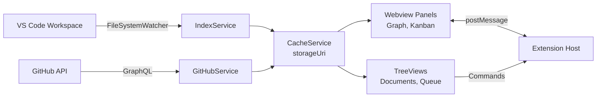

# Agent Org Platform Architecture

## Platform Decision

**MVP는 VS Code Extension으로 구현한다.**

| 구분 | Web App (기존 계획) | VS Code Extension (현재 결정) |
|------|---------------------|-------------------------------|
| 설치 | 서버 + DB + 배포 필요 | 마켓플레이스 원클릭 설치 |
| GitHub 연동 | OAuth 앱 또는 GitHub App 필요 | VS Code 내장 GitHub 인증 |
| 파일 시스템 | 별도 동기화 필요 | 워크스페이스 직접 접근 |
| 워크플로우 | 브라우저 전환 필요 | 코드 작성 중 바로 사용 |
| 실시간 업데이트 | Webhook 서버 필요 | FileSystemWatcher + 폴링 |

---

## System Overview (VS Code Extension)

VS Code Extension은 워크스페이스의 마크다운 파일을 직접 인덱싱하고, GitHub API로 이슈/프로젝트 데이터를 가져와 시각화한다.



---

## Components

### 1) Extension Host (Node.js)

Extension의 메인 프로세스로, 데이터 관리와 GitHub 연동을 담당한다.

**책임**:
- 워크스페이스 파일 감시 (`FileSystemWatcher`)
- 마크다운 인덱싱 및 그래프 빌드
- GitHub 인증 및 API 호출
- 데이터 캐싱 (`context.storageUri`)
- Webview ↔ Extension 메시지 중계

**주요 클래스**:
```typescript
// services/IndexService.ts
class IndexService {
  async indexWorkspace(): Promise<GraphData>
  async indexFile(uri: vscode.Uri): Promise<Artifact>
  watchFiles(): vscode.FileSystemWatcher
}

// services/GitHubService.ts
class GitHubService {
  async authenticate(): Promise<AuthSession>
  async fetchWorkItems(): Promise<WorkItem[]>
  async fetchProjectsV2(): Promise<ProjectItem[]>
}

// services/CacheService.ts
class CacheService {
  async saveGraph(data: GraphData): Promise<void>
  async loadGraph(): Promise<GraphData | undefined>
  async clear(): Promise<void>
}
```

### 2) Indexer

마크다운 파일을 파싱하여 그래프 데이터를 생성한다.

**프로세스**:
1. **Walker**: 워크스페이스의 `vault/` 폴더 순회
2. **Parser**: 각 파일의 frontmatter와 wikilink 추출
3. **Resolver**: wikilink 해석 (canonical → vault-relative → slug)
4. **Builder**: nodes/edges 그래프 구조 생성
5. **Linter**: dangling links, missing metadata 검증

**데이터 흐름**:
```
Markdown Files
    ↓
Parser (gray-matter)
    ↓
Resolver (wikilink resolution)
    ↓
Builder (graph construction)
    ↓
CacheService.save() → storageUri/graph.json
```

### 3) GitHub Integration

VS Code의 내장 GitHub 인증을 사용하여 GitHub 데이터에 접근한다.

**인증**:
```typescript
const session = await vscode.authentication.getSession(
  'github',
  ['repo', 'read:org', 'read:project'],
  { createIfNone: true }
);
```

**데이터 가져오기**:
- Issues: 상태, 라벨, 담당자
- PRs: 체크, 파일, 리뷰 상태
- Projects v2: 아이템, 필드 값, 스테이지

**매핑**:
```typescript
// GitHub Issue → WorkItem
{
  id: issue.node_id,
  number: issue.number,
  title: issue.title,
  stage: extractStageFromLabels(issue.labels), // 'management' | 'research' | ...
  needHuman: hasLabel(issue.labels, 'need:human'),
  // ...
}
```

### 4) UI Components

#### A. Webview Panels

React 기반의 복잡한 UI를 렌더링한다.

**Knowledge Graph Panel**:
- `react-force-graph-2d`로 인터랙티브 그래프
- 노드 타입별 색상 (moc: violet, concept: blue, ...)
- 필터 패널 (type, status, domain)
- 노드 클릭 → 상세 사이드바
- 줌/패닝 컨트롤

**Pipeline Kanban Panel**:
- 4개 컬럼 (Management → Research → Implementation → Quality)
- 카드: 이슈/PR 번호, 제목, 라벨, 담당자
- need-human 뱃지 표시
- 하단 통계 바 (총 아이템, 진행 중, need-human 수)

**통신**:
```typescript
// Extension → Webview
panel.webview.postMessage({
  type: 'graphData',
  data: graphData
});

// Webview → Extension
const vscode = acquireVsCodeApi();
vscode.postMessage({
  type: 'nodeClick',
  nodeId: 'pipeline-model'
});
```

#### B. TreeViews

VS Code 사이드바의 네이티브 트리 UI.

**Documents TreeView**:
- `vault/` 폴더 구조 표시
- 폴더/파일 아이콘
- 클릭 → 파일 열기 (기본 에디터)

**Need Human Queue TreeView**:
- `need:human` 라벨이 붙은 이슈 목록
- 우선순위 뱃지 (P0/P1/P2)
- 대기 시간 표시
- 우클릭 메뉴: 승인/거부

#### C. QuickPick Search

전역 검색 UI (`Cmd+Shift+K`).

**기능**:
- 아티팩트 제목/내용 검색
- 최근 검색 기록
- 검색 결과: 제목, 경로, 관련도 점수
- 선택 → 문서 열기

### 5) Storage

**데이터 저장 위치**:

| 데이터 | 저장 위치 | 형식 |
|--------|-----------|------|
| 인덱스 (그래프) | `context.storageUri/graph.json` | JSON |
| 캐시 (GitHub) | `context.storageUri/cache.json` | JSON |
| 사용자 설정 | `vscode.Configuration` | settings.json |
| 인증 토큰 | `context.secrets` | VS Code secrets |

**스토리지 URI**:
```typescript
const storageUri = context.storageUri; 
// ~/.config/Code/User/workspaceStorage/<hash>/agent-org/
```

---

## Data Flow

### Indexing Flow

```
1. Extension Activation
   └── vault/ 폴더 발견

2. Initial Indexing (첫 활성화 시)
   IndexService.indexWorkspace()
   ├── Walker: 모든 .md 파일 찾기
   ├── Parser: 각 파일 파싱
   ├── Resolver: wikilink 해석
   └── Builder: 그래프 생성
   
3. Cache 저장
   CacheService.saveGraph(graphData)
   └── ~/.vscode/extensions/agent-org/storage/graph.json

4. Incremental Updates (파일 변경 시)
   FileSystemWatcher.onDidChange()
   ├── IndexService.indexFile(uri)
   └── 부분 그래프 업데이트
   
5. Webview 업데이트
   panel.webview.postMessage({ type: 'graphData', data })
```

### GitHub Sync Flow

```
1. 사용자가 "Sync GitHub" 명령 실행
   또는 설정된 간격으로 자동 동기화

2. GitHubService.authenticate()
   └── VS Code GitHub 인증 확인

3. GitHubService.fetchWorkItems()
   ├── GraphQL query: repository issues
   ├── GraphQL query: repository pullRequests
   └── GraphQL query: projectsV2 items

4. 데이터 매핑
   GitHub Issue → WorkItem
   GitHub PR → WorkItem
   Project Item → Pipeline Stage

5. Cache 저장
   CacheService.saveWorkItems(workItems)

6. TreeView/Panel 업데이트
   documentsTreeProvider.refresh()
   panel.webview.postMessage({ type: 'workItems', items })
```

---

## Message Protocol

Extension Host와 Webview 간의 메시지 타입 정의.

### Extension → Webview

```typescript
type ExtensionMessage =
  | { type: 'graphData'; data: GraphData }
  | { type: 'workItems'; items: WorkItem[] }
  | { type: 'updateNode'; node: GraphNode }
  | { type: 'searchResults'; results: Artifact[] }
  | { type: 'error'; message: string };
```

### Webview → Extension

```typescript
type WebviewMessage =
  | { type: 'ready' }
  | { type: 'nodeClick'; nodeId: string }
  | { type: 'cardClick'; itemId: number }
  | { type: 'filterChange'; filters: FilterState }
  | { type: 'search'; query: string }
  | { type: 'openInGitHub'; url: string }
  | { type: 'approveItem'; itemId: number }
  | { type: 'rejectItem'; itemId: number };
```

---

## Trust + Ownership

- **GitHub**: 실행/진행 상황의 source of truth (Issues, PRs, Projects v2)
- **Markdown**: 지식의 source of truth (워크스페이스의 vault/ 폴더)
- **Extension**: 파생된 인덱스 및 어노테이션 저장 (storageUri)
- **워크스페이스**: 원본 마크다운 파일 수정 없음 (read-only)

---

## Security Considerations

1. **GitHub Token**: `context.secrets`에 저장, 메모리에만 로드
2. **Webview CSP**: 모든 리소스는 로컬 번들만 사용 (원격 스크립트 금지)
3. **파일 시스템**: 워크스페이스 파일은 읽기 전용 (쓰기 없음)
4. **Network**: GitHub API만 호출, rate limit 준수

---

## Extension Manifest (package.json)

핵심 기여점:

```json
{
  "activationEvents": [
    "workspaceContains:**/vault/**/*.md",
    "onView:agentOrg.documents"
  ],
  "contributes": {
    "viewsContainers": {
      "activitybar": [{
        "id": "agent-org-explorer",
        "title": "Agent Org",
        "icon": "resources/icon.svg"
      }]
    },
    "views": {
      "agent-org-explorer": [
        { "id": "agentOrg.documents", "name": "Documents" },
        { "id": "agentOrg.queue", "name": "Need Human" }
      ]
    },
    "commands": [
      { "command": "agentOrg.openGraph", "title": "Open Knowledge Graph" },
      { "command": "agentOrg.openKanban", "title": "Open Pipeline Board" },
      { "command": "agentOrg.search", "title": "Search Documents" }
    ]
  }
}
```
