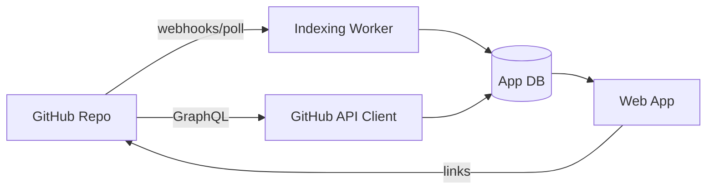

# Agent Org Platform Architecture

## System Overview

We build a web app that ingests a GitHub repo, indexes markdown artifacts, and overlays GitHub progress.

## Components

1) Ingest
- GitHub App installation
- Webhooks: push, pull_request, issues, project_v2_item

2) Indexer
- Walk repo tree
- Parse markdown
- Build graph: nodes/edges
- Lint: dangling/ambiguous links, missing required metadata

3) GitHub Overlay
- Issues + Projects v2 fields
- PRs + checks
- Map to pipeline stage model

4) UI
- Graph view (react-force-graph)
- Kanban view (Projects v2)
- Need-human queue
- Artifact detail page (render markdown + metadata)

## Trust + ownership

- GitHub remains source of truth for execution/progress.
- Markdown remains source of truth for knowledge.
- The platform stores derived indexes and adds annotations.
