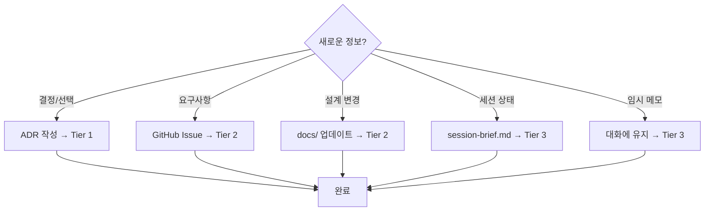

# Source of Truth (SoT) Hierarchy

> **Version**: 1.0  
> **Last Updated**: 2026-02-08  
> **ADR Reference**: [ADR-001](../03-decisions/ADR-001-source-of-truth-hierarchy.md)

---

## Overview

이 문서는 Agent Org Platform 프로젝트의 **정보 권위 계층 (Source of Truth Hierarchy)**를 정의합니다.
AI 에이전트와 인간이 협업할 때, 어떤 정보를 어디서 찾아야 하는지 명확히 합니다.

---

## The Three Tiers

```
┌─────────────────────────────────────────────────────────────────┐
│                     🔴 TIER 1: IMMUTABLE                        │
│                    (변경 불가 - 영구 보존)                        │
│                                                                 │
│   ┌─────────────────────┐    ┌─────────────────────┐           │
│   │   ADR (Decisions)   │    │   Tests (Contracts) │           │
│   │   docs/03-decisions │    │   tests/, *.test.ts │           │
│   └─────────────────────┘    └─────────────────────┘           │
│                                                                 │
│   Rule: Never delete. Supersede with new ADR if needed.        │
└─────────────────────────────────────────────────────────────────┘
                              │
                              ▼
┌─────────────────────────────────────────────────────────────────┐
│                     🟡 TIER 2: MUTABLE                          │
│                    (변경 가능 - 버전 관리)                        │
│                                                                 │
│   ┌─────────────────────┐    ┌─────────────────────┐           │
│   │   docs/ (Specs)     │    │   GitHub Issues     │           │
│   │   Architecture,     │    │   Requirements,     │           │
│   │   Design, Guides    │    │   Tasks, Bugs       │           │
│   └─────────────────────┘    └─────────────────────┘           │
│                                                                 │
│   Rule: Update via PR. Track changes in git history.           │
└─────────────────────────────────────────────────────────────────┘
                              │
                              ▼
┌─────────────────────────────────────────────────────────────────┐
│                     🟢 TIER 3: VOLATILE                         │
│                    (휘발성 - 세션 스코프)                         │
│                                                                 │
│   ┌─────────────────────┐    ┌─────────────────────┐           │
│   │   session-brief.md  │    │   Conversation      │           │
│   │   Session snapshot  │    │   Current context   │           │
│   └─────────────────────┘    └─────────────────────┘           │
│                                                                 │
│   Rule: Overwrite each session. Not permanent record.          │
└─────────────────────────────────────────────────────────────────┘
```

---

## Tier Details

### Tier 1: Immutable (변경 불가)

| Source | Location | Purpose | Rule |
|--------|----------|---------|------|
| **ADR** | `docs/03-decisions/ADR-*.md` | 결정의 이유(Why) 기록 | 삭제 금지. Supersede로 대체 |
| **Tests** | `tests/`, `*.test.ts`, `*.spec.ts` | 동작 계약 보장 | 테스트 통과 = 기능 보장 |

**왜 Immutable인가?**
- ADR은 "왜 이렇게 결정했나"의 역사적 기록
- 테스트는 "이 동작이 올바르다"의 계약
- 삭제하면 컨텍스트와 신뢰를 잃음

### Tier 2: Mutable (변경 가능)

| Source | Location | Purpose | Rule |
|--------|----------|---------|------|
| **Architecture** | `docs/02-architecture/` | 시스템 설계 문서 | PR로 변경, 리뷰 필요 |
| **PRD** | `docs/01-vision/` | 제품 요구사항 | 비즈니스 승인 필요 |
| **Guides** | `docs/` | 가이드, 매뉴얼 | 자유롭게 업데이트 |
| **GitHub Issues** | GitHub | 작업 추적, 버그, 요청 | 상태 업데이트 지속 |

**왜 Mutable인가?**
- 프로젝트가 진화하면서 문서도 진화
- Git history로 변경 추적 가능
- 현재 상태 반영이 중요

### Tier 3: Volatile (휘발성)

| Source | Location | Purpose | Rule |
|--------|----------|---------|------|
| **Session Brief** | `docs/06-status/session-brief.md` | 세션 핸드오프 | 매 세션 덮어쓰기 |
| **Conversation** | Claude session | 현재 작업 컨텍스트 | 세션 종료 시 손실 |

**왜 Volatile인가?**
- 세션별 컨텍스트는 일시적
- 중요한 정보는 Tier 1/2로 승격해야 함
- Session Brief는 "부트 로더" 역할

---

## Decision Flow



---

## Lookup Priority

정보를 찾을 때의 우선순위:

1. **CLAUDE.md** → 프로젝트 규칙, 핵심 참조
2. **session-brief.md** → 현재 상태, 진행 중인 작업
3. **GitHub Issues** → 요구사항, 작업 추적
4. **docs/** → 설계, 아키텍처, 가이드
5. **ADR** → 과거 결정의 이유
6. **Tests** → 기대 동작 확인

---

## For AI Agents

### Session Start Checklist

```markdown
1. [ ] Read CLAUDE.md (project rules)
2. [ ] Read session-brief.md (current state)
3. [ ] Check GitHub Issues (active tasks)
4. [ ] Review recent ADRs (recent decisions)
```

### Session End Checklist

```markdown
1. [ ] Update session-brief.md with:
   - What was done
   - What's blocked
   - What's next
2. [ ] Create ADR if major decision was made
3. [ ] Update GitHub Issues (close completed, update status)
4. [ ] Commit all changes
```

### Information Promotion

| From (Volatile) | To (Permanent) | When |
|-----------------|----------------|------|
| Conversation insight | ADR | 중요한 결정을 내렸을 때 |
| Conversation insight | docs/ | 반복 사용될 정보일 때 |
| Session brief item | GitHub Issue | 추적이 필요한 작업일 때 |

---

## Related Documents

| Document | Purpose |
|----------|---------|
| [ADR-001](../03-decisions/ADR-001-source-of-truth-hierarchy.md) | 이 계층의 결정 근거 |
| [Session Brief](../06-status/session-brief.md) | 현재 세션 상태 |
| [Consistency Guide](../ai-agent-project-consistency-guide.md) | 전체 일관성 가이드 |
| [CLAUDE.md](../../CLAUDE.md) | 프로젝트 규칙 |
