# AI 에이전트 기반 대형 프로젝트 일관성 유지 가이드

> **Version**: 1.0  
> **Last Updated**: 2026-02-08  
> **Purpose**: AI 에이전트들이 대형 프로젝트를 일관성 있게 수행하기 위한 구조와 방법론

---

## 목차

1. [핵심 원칙](#1-핵심-원칙)
2. [Claude Code의 구조적 특성과 한계](#2-claude-code의-구조적-특성과-한계)
3. [프로젝트 초기화 체크리스트](#3-프로젝트-초기화-체크리스트)
4. [권장 폴더 구조](#4-권장-폴더-구조)
5. [정보 저장 전략](#5-정보-저장-전략)
6. [세션 간 지식 전달](#6-세션-간-지식-전달)
7. [작업 분해 및 추적](#7-작업-분해-및-추적)
8. [결정 기록 (ADR)](#8-결정-기록-adr)
9. [품질 게이트](#9-품질-게이트)
10. [실전 템플릿](#10-실전-템플릿)

---

## 1. 핵심 원칙

### 1.1 단일 진실 공급원 (Single Source of Truth)

```
💡 핵심 통찰:
   "대화는 캐시, 파일/이슈는 메모리"
   
   AI 에이전트의 일관성은 대화 컨텍스트가 아니라
   저장된 문서/이슈/테스트로 유지됩니다.
```

### 1.2 SoT 계층 구조

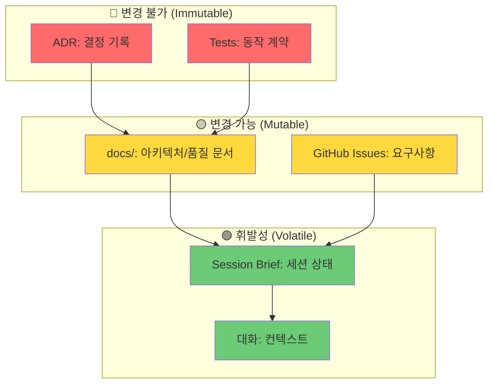

### 1.3 5가지 필수 정의 항목

| 순서 | 항목 | 왜 먼저 정해야 하는가 |
|------|------|----------------------|
| 1️⃣ | **비즈니스 목표** | 모든 결정의 기준점 |
| 2️⃣ | **기술 스택** | 구조와 도구 선택의 제약 |
| 3️⃣ | **폴더 구조** | 코드 배치의 일관성 |
| 4️⃣ | **테스트 전략** | 품질 보장의 계약 |
| 5️⃣ | **진행 추적 체계** | 상태 파악과 핸드오프 |

---

## 2. Claude Code의 구조적 특성과 한계

### 2.1 컨텍스트 윈도우 제한

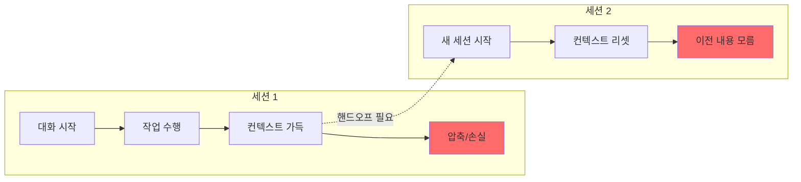

### 2.2 한계 극복 전략

| 한계 | 문제 | 해결책 |
|------|------|--------|
| 컨텍스트 손실 | 긴 대화에서 초기 내용 망각 | `CLAUDE.md`에 핵심 규칙 고정 |
| 세션 분리 | 새 세션에서 이전 작업 모름 | `session-brief.md`로 핸드오프 |
| 에이전트 간 단절 | 다른 에이전트가 뭘 했는지 모름 | 아티팩트 링크로 공유 (파일, 이슈, PR) |
| 결정 휘발 | "왜 이렇게 했지?" 망각 | ADR로 결정 영구 기록 |

### 2.3 파일 기반 지속성 활용

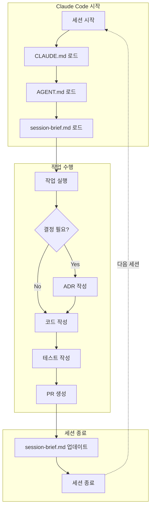

---

## 3. 프로젝트 초기화 체크리스트

### 3.1 Phase 0: 비즈니스 정의 (1-2시간)

```markdown
## docs/01-vision/business-objectives.md

### 목표 (Goals)
- [ ] 핵심 KPI 정의
- [ ] 성공 기준 명시
- [ ] 타임라인 설정

### 비목표 (Non-Goals)
- [ ] 명시적으로 하지 않을 것 정의
- [ ] 스코프 경계 설정

### 사용자 시나리오
- [ ] 핵심 사용자 정의
- [ ] 주요 사용 흐름 문서화

### 비즈니스 엣지 (정책/제약)
- [ ] 법무/규정 제약
- [ ] 과금/수익 모델
- [ ] 데이터 보존 정책
- [ ] 권한/접근 정책
```

### 3.2 Phase 1: 기술 스택 정의 (2-4시간)

```markdown
## docs/01-vision/tech-stack.md

### 런타임/언어
| 영역 | 선택 | 이유 | 대안 (기각 이유) |
|------|------|------|------------------|
| Backend | Node.js + TypeScript | 팀 역량, 생태계 | Python (팀 비선호) |
| Frontend | React + TypeScript | 컴포넌트 재사용 | Vue (생태계 작음) |
| Database | PostgreSQL | 관계형 필요 | MongoDB (스키마 필요) |

### 변경 트리거
- TPS > 10,000 시 → DB 샤딩 검토
- 비용 > $X/월 시 → 서버리스 검토
```

### 3.3 Phase 2: 폴더 구조 확정 (1-2시간)

```markdown
## docs/02-architecture/project-structure.md

### 레이어 규칙
- `src/domain/` → 비즈니스 로직 (외부 의존 금지)
- `src/infra/` → 외부 연동 (DB, API)
- `src/ui/` → 프레젠테이션 레이어

### 금지 규칙
❌ domain → ui (역방향 의존)
❌ ui → infra (직접 DB 접근)
✅ ui → domain → infra
```

### 3.4 Phase 3: 테스트 전략 (2-4시간)

```markdown
## docs/04-quality/test-strategy.md

### 테스트 피라미드
| 레벨 | 비율 | 실행 시점 | 명령어 |
|------|------|----------|--------|
| Unit | 70% | 모든 PR | `npm test` |
| Integration | 20% | PR + nightly | `npm run test:int` |
| E2E | 10% | Pre-release | `npm run test:e2e` |

### PR 필수 요건
- [ ] 버그 수정 → 재현 테스트 1개 필수
- [ ] 새 기능 → 핵심 경로 테스트 필수
- [ ] 커버리지 80% 이상 유지
```

### 3.5 Phase 4: 진행 추적 체계 (1-2시간)

```markdown
## docs/06-status/progress-tracking.md

### 이슈 라벨 체계
| 카테고리 | 라벨 | 설명 |
|----------|------|------|
| Type | `type:feature`, `type:bug`, `type:chore` | 작업 유형 |
| Area | `area:frontend`, `area:backend`, `area:infra` | 영향 영역 |
| Priority | `prio:p0`, `prio:p1`, `prio:p2` | 우선순위 |
| Status | `status:ready`, `status:blocked`, `need:human` | 상태 |

### Done 정의
- [ ] 코드 리뷰 완료
- [ ] 테스트 통과
- [ ] 문서 업데이트 (해당 시)
- [ ] PR 머지
```

---

## 4. 권장 폴더 구조

### 4.1 프로젝트 루트 트리

```
.
├── 📄 CLAUDE.md                    # AI 에이전트 운영 규칙
├── 📄 AGENT.md                     # 프로젝트 지식 인덱스
├── 📄 README.md                    # 프로젝트 개요
│
├── 📁 docs/
│   ├── 📁 00-system/               # 메타 정보
│   │   ├── source-of-truth.md      # SoT 정의
│   │   ├── working-agreements.md   # 작업 규약
│   │   └── glossary.md             # 용어집
│   │
│   ├── 📁 01-vision/               # 비전 & 목표
│   │   ├── business-objectives.md  # 비즈니스 목표
│   │   ├── prd.md                  # 제품 요구사항
│   │   └── tech-stack.md           # 기술 스택
│   │
│   ├── 📁 02-architecture/         # 아키텍처
│   │   ├── architecture.md         # 시스템 아키텍처
│   │   ├── data-model.md           # 데이터 모델
│   │   └── project-structure.md    # 폴더 구조 규칙
│   │
│   ├── 📁 03-decisions/            # 결정 기록 (ADR)
│   │   ├── adr-template.md         # ADR 템플릿
│   │   ├── adr-0001-*.md           # 개별 ADR
│   │   └── ...
│   │
│   ├── 📁 04-quality/              # 품질 관리
│   │   ├── test-strategy.md        # 테스트 전략
│   │   ├── quality-gates.md        # 품질 게이트
│   │   └── 📁 runbooks/            # 운영 가이드
│   │
│   ├── 📁 05-backlog/              # 백로그
│   │   └── backlog.md              # 에픽 & 백로그
│   │
│   └── 📁 06-status/               # 상태 관리 ⭐
│       ├── session-brief.md        # 세션 핸드오프
│       ├── progress-tracking.md    # 진행 추적 규칙
│       ├── 📁 handoffs/            # 핸드오프 기록
│       └── 📁 weekly/              # 주간 스냅샷
│
├── 📁 src/                         # 소스 코드
│   ├── 📁 domain/                  # 비즈니스 로직
│   ├── 📁 infra/                   # 인프라 레이어
│   └── 📁 ui/                      # UI 레이어
│
├── 📁 tests/                       # 테스트 코드
│   ├── 📁 unit/
│   ├── 📁 integration/
│   └── 📁 e2e/
│
├── 📁 scripts/                     # 빌드/배포 스크립트
│
├── 📁 .github/                     # GitHub 설정
│   ├── 📁 ISSUE_TEMPLATE/          # 이슈 템플릿
│   ├── PULL_REQUEST_TEMPLATE.md    # PR 템플릿
│   └── 📁 workflows/               # CI/CD
│
└── 📁 .omc/                        # OMC 상태 (자동)
    └── 📁 state/
```

### 4.2 폴더별 역할 다이어그램

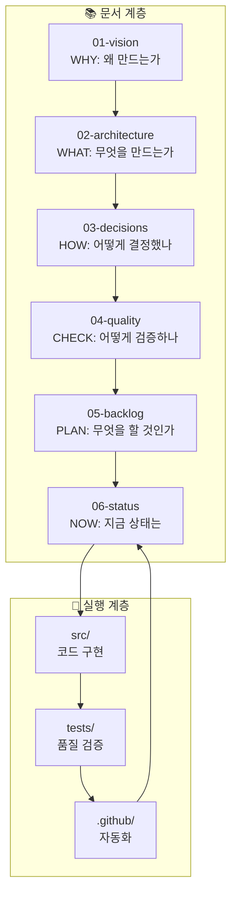

---

## 5. 정보 저장 전략

### 5.1 어디에 무엇을 저장하는가

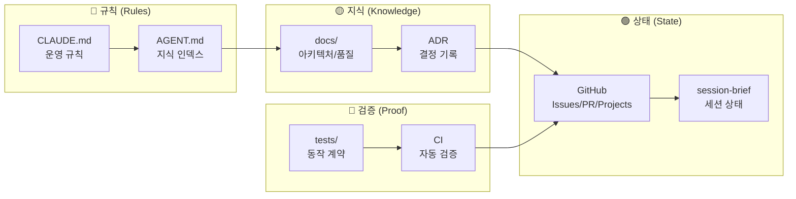

### 5.2 저장 레이어별 상세

| 레이어 | 파일/위치 | 저장 내용 | 수정 빈도 |
|--------|----------|----------|----------|
| **CLAUDE.md** | 루트 | 코딩 규칙, 금지사항, 필수 명령 | 드물게 |
| **AGENT.md** | 루트 | 프로젝트 개요, 핵심 링크 모음 | 가끔 |
| **ADR** | docs/03-decisions/ | 결정과 근거 (불변) | 추가만 |
| **docs/** | docs/01~05/ | 아키텍처, 품질, 백로그 | 정기적 |
| **GitHub** | Issues/PR/Projects | 진행 상태, 논의, 승인 | 빈번 |
| **session-brief** | docs/06-status/ | 현재 세션 상태 | 매 세션 |
| **tests/** | tests/ | 동작 계약 (가장 강한 기억) | 코드와 함께 |

---

## 6. 세션 간 지식 전달

### 6.1 핸드오프 흐름

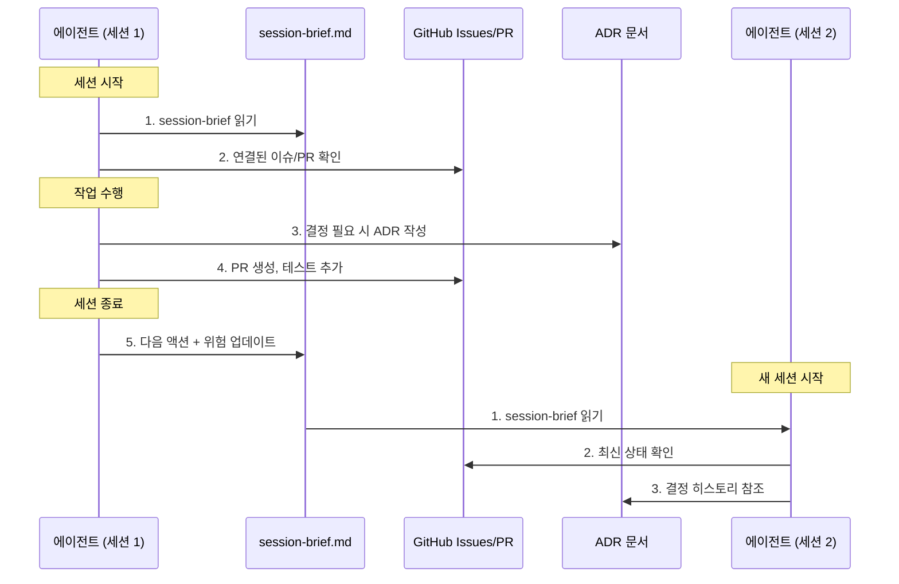

### 6.2 session-brief.md 구조

```markdown
# Session Brief

> 최종 업데이트: 2026-02-08 09:30 UTC

## 🎯 현재 목표
- 이슈 #42: 로그인 기능 구현

## 📍 현재 상태
- 브랜치: `feature/login-42`
- 마지막 커밋: `abc1234` - "feat: add login form"
- PR: #45 (Draft)

## ✅ 완료된 것
- [x] 로그인 폼 UI
- [x] 유효성 검증

## 🔜 다음 3가지 액션
1. [ ] 인증 API 연동
2. [ ] 에러 핸들링
3. [ ] 테스트 작성

## ⚠️ 주의/위험
- API 응답 스키마 미확정 (백엔드 팀 확인 필요)
- ADR-0012 참조: JWT vs 세션 결정

## 🔗 핵심 링크
- 이슈: #42
- PR: #45
- 관련 ADR: ADR-0012
```

### 6.3 에이전트 간 정보 공유

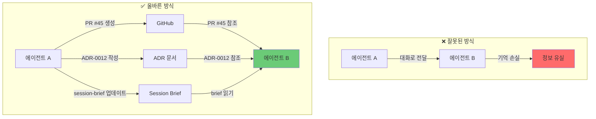

---

## 7. 작업 분해 및 추적

### 7.1 작업 계층 구조

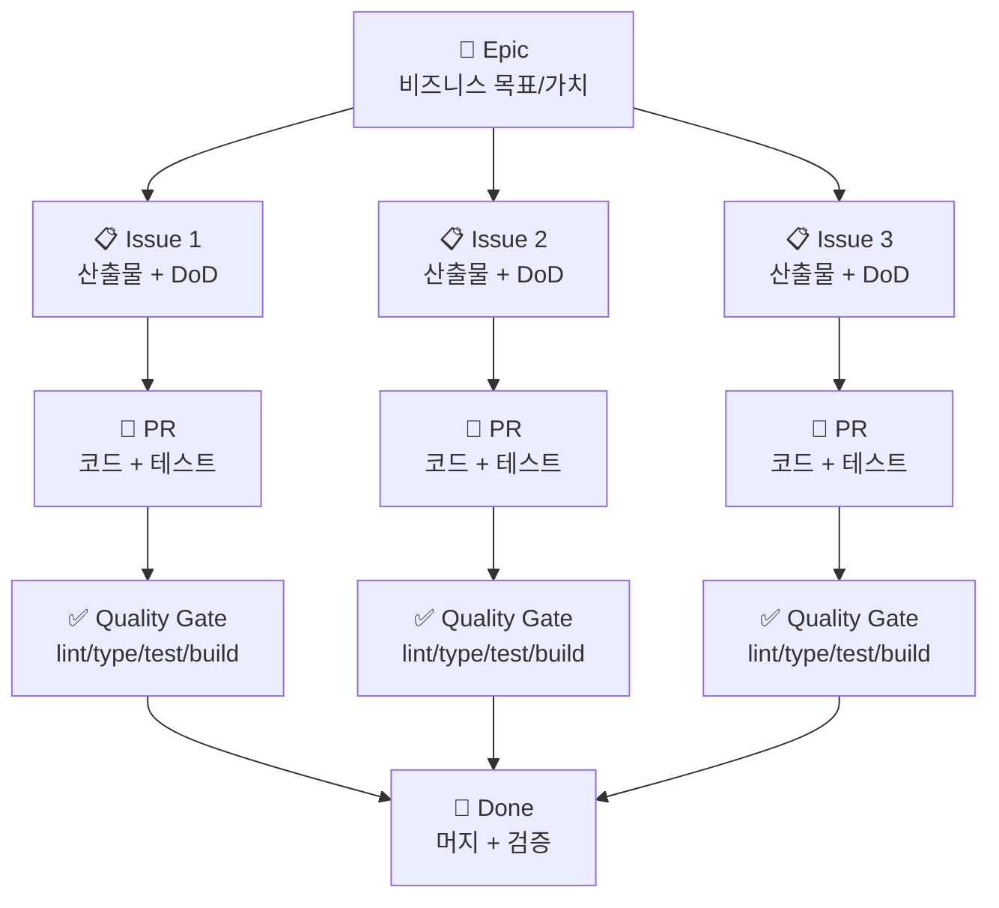

### 7.2 이슈 템플릿

```markdown
## 📋 이슈 제목

### 요구사항 (Requirements)
- 사용자는 ~할 수 있어야 한다

### 완료 조건 (Definition of Done)
- [ ] 기능 구현 완료
- [ ] 테스트 작성 (커버리지 80%+)
- [ ] 문서 업데이트
- [ ] 코드 리뷰 승인

### 기술 고려사항
- API 스펙: #123 참조
- ADR: ADR-0005 (해당 시)

### 테스트 시나리오
1. Given: 사용자가 로그인 페이지에 있을 때
2. When: 올바른 자격증명 입력 시
3. Then: 대시보드로 이동

### 위험/우려사항
- 동시 접속 시 성능 확인 필요
```

---

## 8. 결정 기록 (ADR)

### 8.1 ADR이 필요한 경우

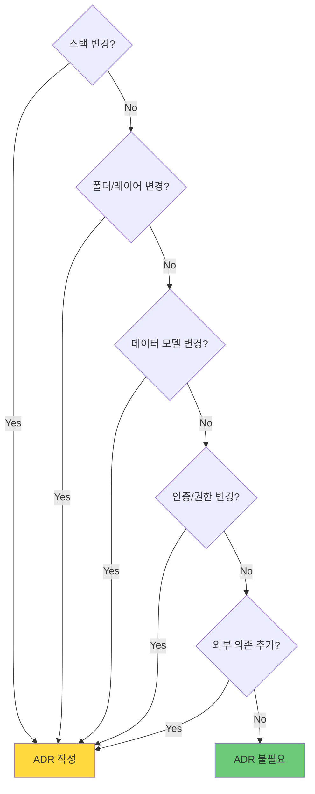

### 8.2 ADR 템플릿

```markdown
# ADR-0007: [결정 제목]

## Status
Accepted | Proposed | Deprecated

## Context
### 문제/제약
- 현재 상황 설명

### 목표
- 달성하고자 하는 것

## Decision
우리는 **[X]**를 선택한다.

## Consequences
### 장점
- 이점 1
- 이점 2

### 단점/리스크
- 위험 1
- 완화책: ...

## Alternatives Considered
| 대안 | 장점 | 단점 | 기각 이유 |
|------|------|------|----------|
| A | ... | ... | ... |
| B | ... | ... | ... |

## Links
- 관련 이슈: #42
- 관련 PR: #45
- 참조 문서: [링크]
```

### 8.3 ADR 흐름

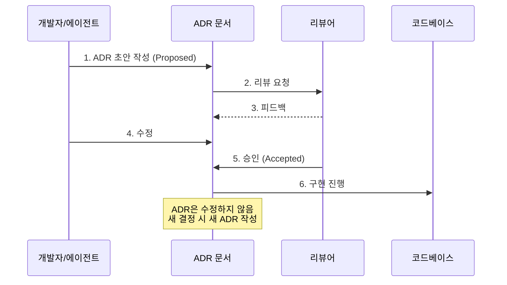

---

## 9. 품질 게이트

### 9.1 품질 게이트 구조

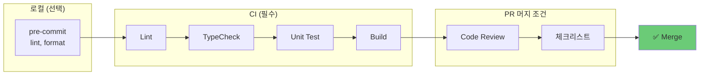

### 9.2 PR 템플릿

```markdown
## 📝 변경 사항
<!-- 이 PR에서 변경한 내용 -->

## 🔗 관련 이슈
Closes #

## ✅ 체크리스트
### 필수
- [ ] 테스트 추가/수정
- [ ] 타입 체크 통과 (`npm run typecheck`)
- [ ] 린트 통과 (`npm run lint`)
- [ ] 빌드 성공 (`npm run build`)

### 해당 시
- [ ] ADR 작성 (구조/스택 변경 시)
- [ ] 문서 업데이트
- [ ] 마이그레이션 스크립트
- [ ] 롤백 계획

## 📸 스크린샷 (UI 변경 시)

## ⚠️ 리뷰어 주의사항
```

### 9.3 CI 워크플로우 예시

```yaml
# .github/workflows/ci.yml
name: CI

on: [push, pull_request]

jobs:
  quality:
    runs-on: ubuntu-latest
    steps:
      - uses: actions/checkout@v4
      
      - name: Setup Node
        uses: actions/setup-node@v4
        with:
          node-version: '20'
          cache: 'npm'
      
      - name: Install
        run: npm ci
      
      - name: Lint
        run: npm run lint
      
      - name: TypeCheck
        run: npm run typecheck
      
      - name: Test
        run: npm test -- --coverage
      
      - name: Build
        run: npm run build
```

---

## 10. 실전 템플릿

### 10.1 CLAUDE.md 템플릿

```markdown
# Project Rules for AI Agents

## 필수 참조 문서
| 문서 | 경로 | 용도 |
|------|------|------|
| 지식 인덱스 | `AGENT.md` | 프로젝트 개요 |
| 아키텍처 | `docs/02-architecture/` | 구조 규칙 |
| 세션 상태 | `docs/06-status/session-brief.md` | 현재 상태 |

## 코딩 규칙
- TypeScript strict mode 사용
- 함수는 단일 책임 원칙
- 파일당 200줄 이하 권장

## 금지 사항
❌ `any` 타입 사용 금지
❌ `@ts-ignore` 금지
❌ 테스트 없는 PR 금지
❌ ADR 없는 구조 변경 금지

## 필수 명령어
- 테스트: `npm test`
- 빌드: `npm run build`
- 린트: `npm run lint`
- 타입체크: `npm run typecheck`

## PR 규칙
- 브랜치: `feature/이슈번호-설명`
- 커밋: Conventional Commits 형식
- 리뷰: 최소 1명 승인 필요

## Human Gate
`need:human` 라벨 → 반드시 인간 승인 후 진행
```

### 10.2 AGENT.md 템플릿

```markdown
# Project Knowledge Base

## 프로젝트 개요
[프로젝트 설명 2-3문장]

## 현재 상태
📍 **Phase**: MVP 개발 중
📍 **Sprint**: Sprint 3
📍 **세션 상태**: [session-brief.md](docs/06-status/session-brief.md)

## 핵심 문서 맵
| 영역 | 문서 |
|------|------|
| 비전 | [PRD](docs/01-vision/prd.md) |
| 아키텍처 | [Architecture](docs/02-architecture/architecture.md) |
| 결정 | [ADRs](docs/03-decisions/) |
| 품질 | [Test Strategy](docs/04-quality/test-strategy.md) |
| 백로그 | [Backlog](docs/05-backlog/backlog.md) |

## 기술 스택
- Frontend: React + TypeScript
- Backend: Node.js + Express
- Database: PostgreSQL
- [상세](docs/01-vision/tech-stack.md)

## 폴더 구조
```
src/
├── domain/    # 비즈니스 로직
├── infra/     # 외부 연동
└── ui/        # 프레젠테이션
```
[상세](docs/02-architecture/project-structure.md)

## 최근 결정
- [ADR-0005](docs/03-decisions/adr-0005-auth.md): JWT 인증 선택
- [ADR-0006](docs/03-decisions/adr-0006-state.md): 상태 관리 방식
```

### 10.3 전체 흐름 다이어그램

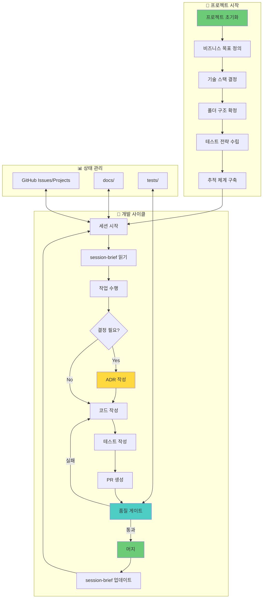

---

## 부록: 자주 무너지는 지점과 대응

| 문제 | 증상 | 해결책 |
|------|------|--------|
| 문서가 안 읽힘 | AGENT.md가 너무 김 | 링크 인덱스로만 유지, 상세는 docs/로 |
| 결정이 휘발됨 | "왜 이렇게 했지?" | 스택/구조 변경 시 ADR 필수 규칙 |
| 테스트 미루기 | "나중에 작성" | 버그 수정 = 재현 테스트 필수 |
| 이중 추적 | 파일과 이슈에 동시 기록 | SoT를 하나로 (GitHub), 문서는 캐시만 |
| 세션 단절 | 새 세션에서 방향 상실 | session-brief 필수 업데이트 |

---

## 참고 자료

- [Anthropic: Building Effective Agents](https://www.anthropic.com/research/building-effective-agents)
- [Architecture Decision Records](https://adr.github.io/)
- [Claude Code Architecture Guide](./claude-code-architecture.md)
